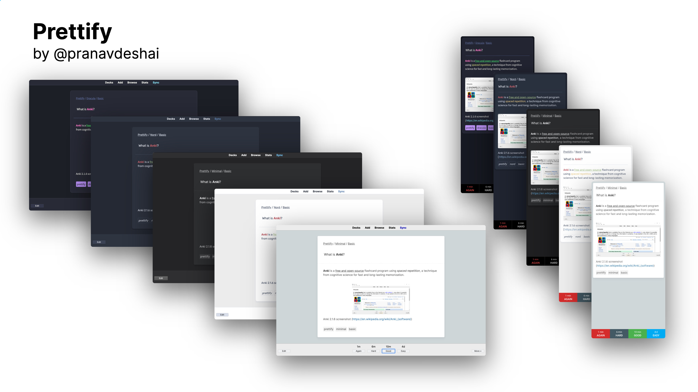
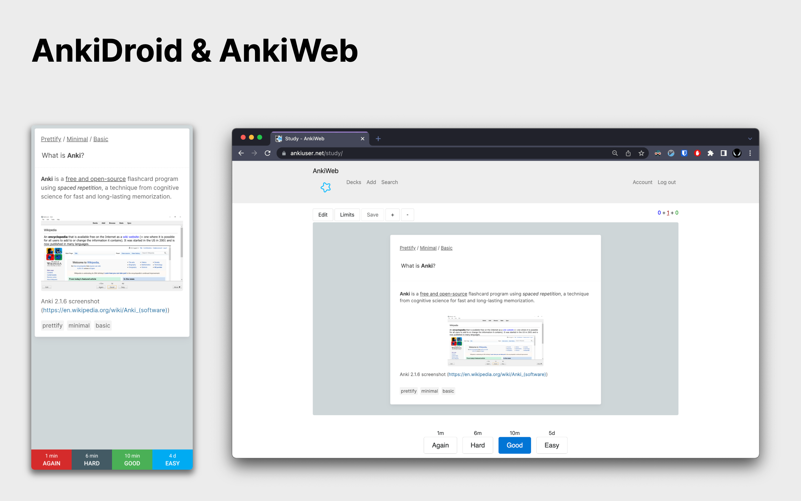
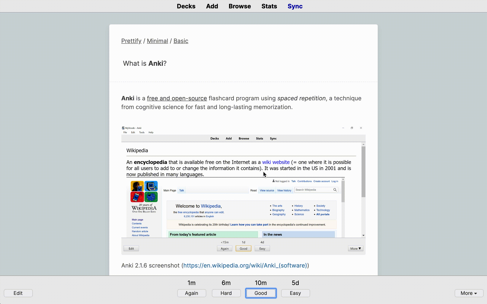
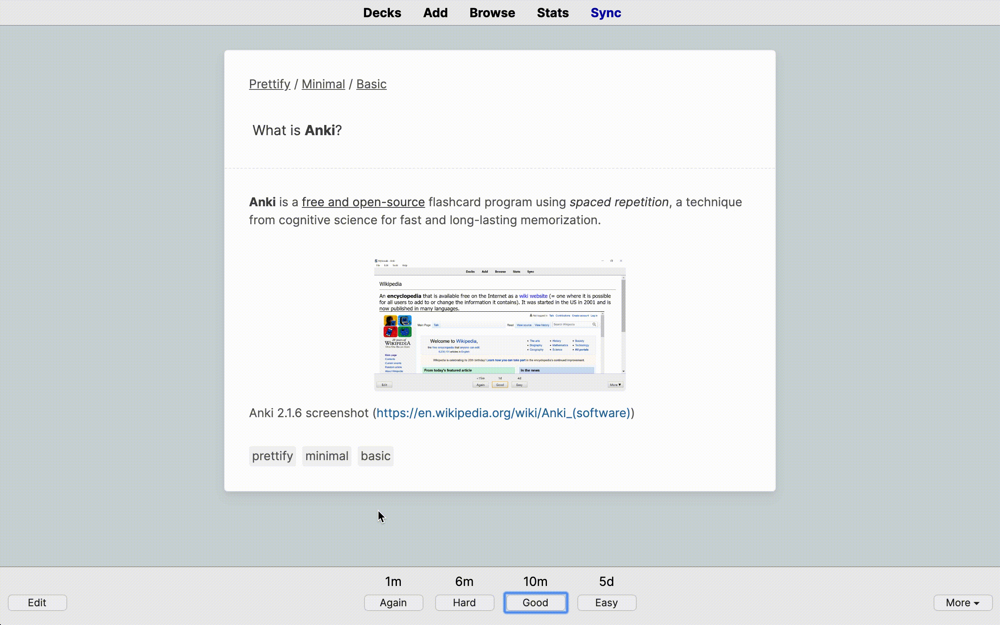
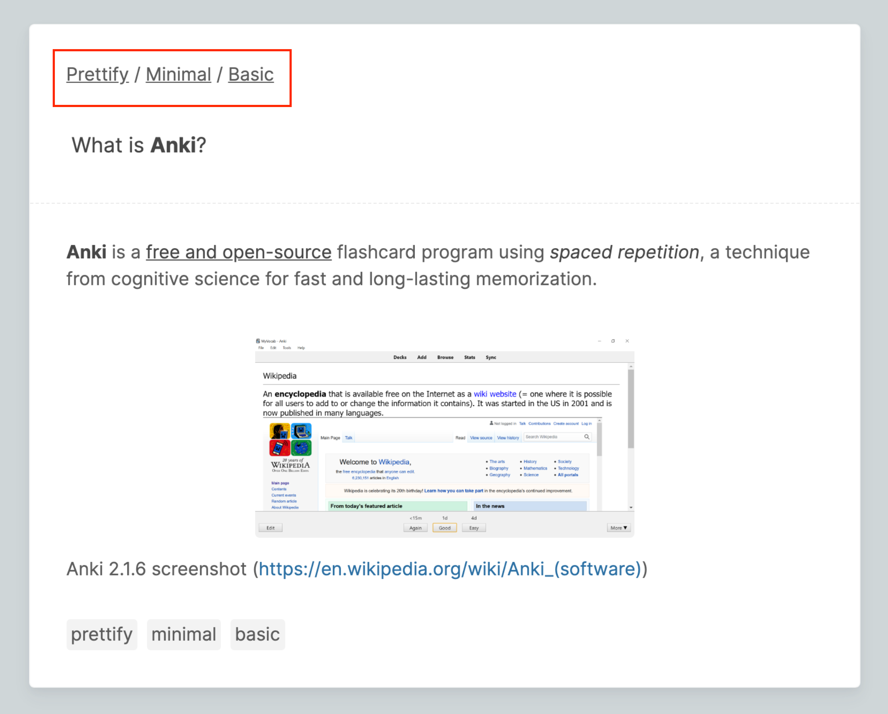
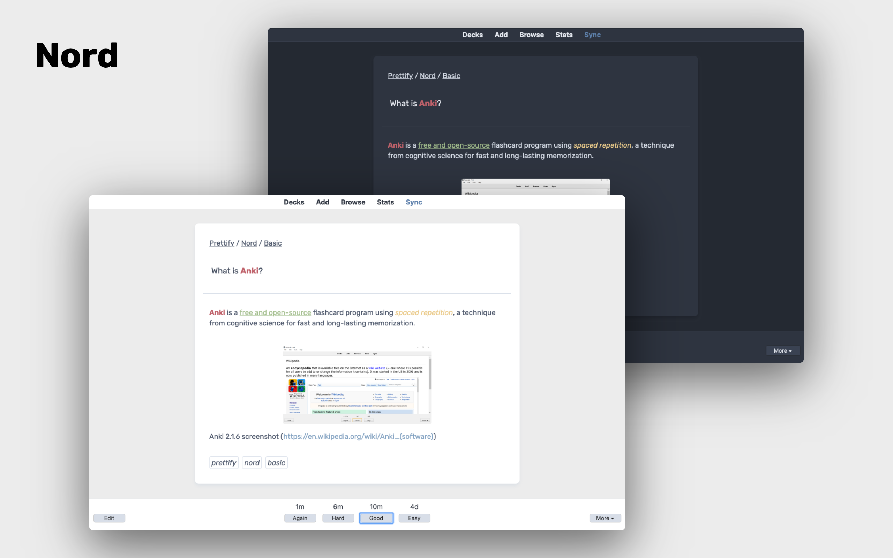
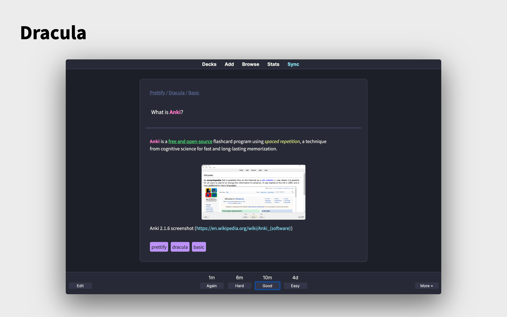

# Prettify

Collection of customizable Anki flashcard templates with modern and clean themes.

# Contents

- [About](#about)
- [Features](#features)
- [Themes](#themes)
- [Instructions](#instructions)
- [Add-on support](#add-on-support)
- [Compatibility](#compatibility)
- [Requirements](#requirements)
- [Plans for future](#plans-for-future)
- [Support development](#support-development)

## About

Designed all the way from scratch, the goal is to make flashcards much more interesting to look at and reduce distractions, all while preserving the robust functionality Anki offers or even improving upon it.

## Features

### Responsive design

Supported on desktop, mobile and web!

### Image expansion to card width on hover

### Image expansion to screen width on click

### Tags for quick context

### Breadcrumbs to current deck

### More useful features

- Dark and light themes
- Customizable color palettes
- Preferences for tweaking styles
- Fast rendering using CSS with minimal JavaScript

## Themes

| Theme                                          | Download                                        | Font                                                                 |
| ---------------------------------------------- | ----------------------------------------------- | -------------------------------------------------------------------- |
|  | [Minimal](themes/minimal/prettify-minimal.apkg) | [Inter](https://rsms.me/inter/)                                      |
|        | [Nord](themes/nord/prettify-nord.apkg)          | [Rubik](https://rsms.me/inter/)                                      |
|  | [Dracula](themes/dracula/prettify-dracula.apkg) | [Source Sans Pro](https://fonts.google.com/specimen/Source+Sans+Pro) |

## Instructions

### Installation

#### Direct download (Recommended)

- Click on link in the above table to download the deck with the specific theme.

- Download [`prettify.apkg`](prettify.apkg) to install all the themes in one master deck.

- To download decks for specific note type, choose the note type folder from the `notetypes` directory under the theme directory. (E.`themes/THEME/notetypes/NOTETYPE`)

> **Note**: Download links to accompanying fonts to themes are provided above. Refer to [Anki Manual - Installing Fonts](https://docs.ankiweb.net/templates/styling.html#installing-fonts) for instructions.

#### Manual method

Source code (templates and themes) is located in the [`src`](src) directory.

1. Create a new note type (See [Adding a note type](https://docs.ankiweb.net/editing.html#adding-a-note-type))
2. Click on `Cards` in browser mode
3. Copy the contents of `NOTETYPE-front.html` and `NOTETYPE-back.html` (from [`templates`](src/templates/default/) directory) into the _Front_ and _Back_ templates of the note type where
4. Copy the content of `THEME.css` (from [`css`](/src/styles/css) directory) into the _Styling_ section where THEME is the name of the theme
5. You can now use the new note type in your collection!

### Usage

1. Download the deck package
2. Open Anki and click on `Import File` (`⋮` -> `Import` in AnkiDroid)
3. Select the downloaded file
4. The new note type(s), `THEME-NOTETYPE` should be created automatically
5. Use the note type(s) or [clone](https://docs.ankiweb.net/editing.html#adding-a-note-type) to adapt to your needs

### Update

To update to the latest version of Prettify (themes/note types), just download the required decks again.

> **Important**: The already existing templates and styles will be _overwritten_ once you import the deck with updated content. To avoid any loss of edits, it is highly recommended that you use clones of the downloaded note types. (Refer to [Anki manual - Adding a note type](https://docs.ankiweb.net/editing.html#adding-a-note-type) for instructions on cloning a note type).

## Add-on support

The following add-ons are currently supported

- [Clickable Tags](https://ankiweb.net/shared/info/1739176371)
- [Edit Field During Review (Cloze)](https://ankiweb.net/shared/info/385888438)

> **Note**: Add-ons are optional and not necessary. The templates work as expected _with or without_ the add-ons.

## Compatibility

Tested on

- **Desktop**: Anki 2.1.49+ (Mac)
- **Mobile**: AnkiDroid 2.15+
- **Browsers** (AnkiWeb): Chrome (97.0.4692.71+), Safari (15.0+)

> **Note**: Although tested on relatively newer versions of Anki, all the themes should work as expected with all versions of Anki 2.1+.

## Requirements

- Anki 2.1 or higher (should work with Anki 2.0)

## Plans for future

- [x] New theme
- [ ] More themes!
- [ ] "Type in the answer" note type

## Support development

If you like my work, you can support the development by

- Starring the project on GitHub
- Following me on GitHub
- [Buying me a coffee](https://www.buymeacoffee.com/pranavdeshai)
- # Donating on [Ko-fi](https://ko-fi.com/pranavdeshai)
