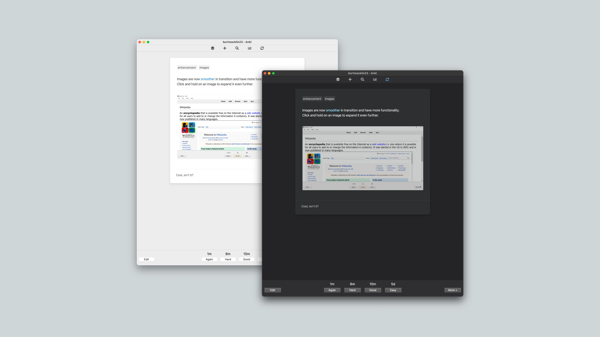

# Minimal

Anki flashcard template based on the flashcard app - Mochi.

## Desktop appearance

  
  

## Mobile appearance

  
  

## Note types

-   [Basic](./minimal-basic)
-   [Cloze](./minimal-cloze)

## Instructions
See [home page](../../README.md/#instructions)
